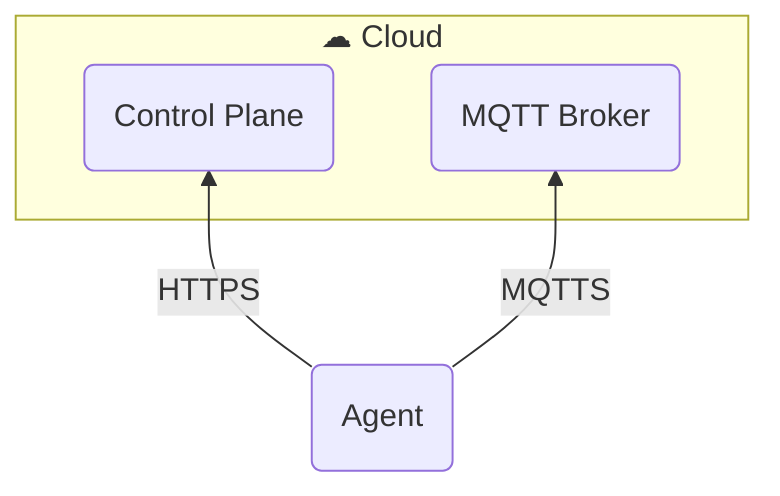
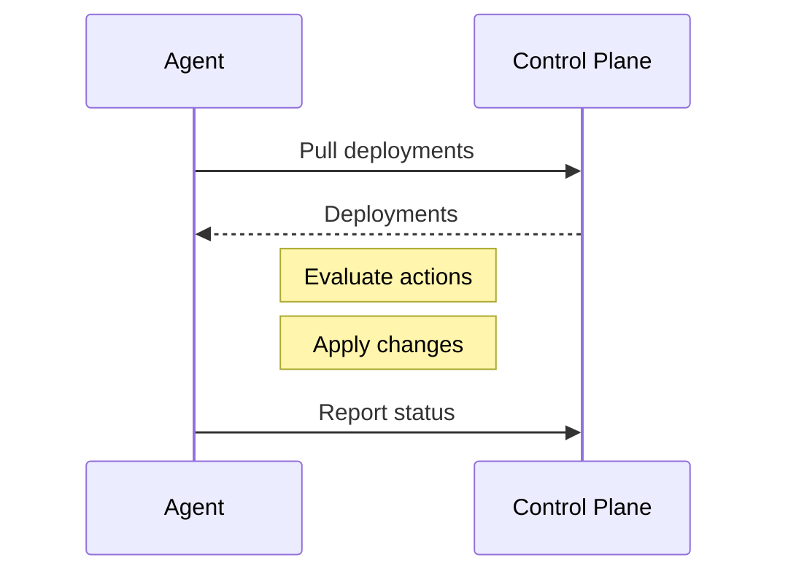
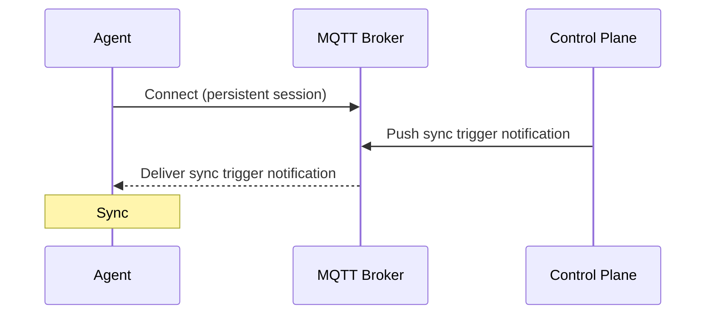
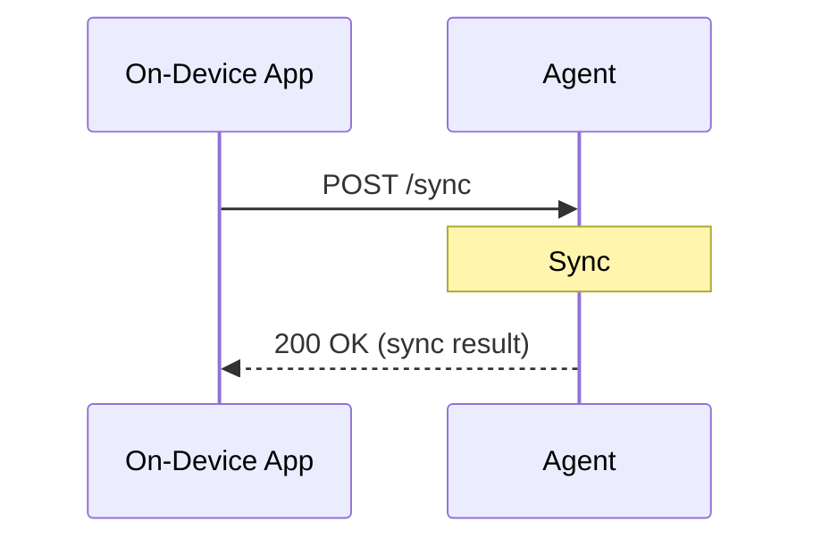

The Miru Agent is a background service that keeps your device's configurations in sync with the Miru control plane. This page explains how the agent communicates with the control plane, how deployments reach your device, and what to expect during normal operation, failures, and restarts.

## Communication Protocols

The Miru Agent communicates with the Miru control plane through outbound-only channels. All traffic is initiated by the agent—no inbound ports need to be opened on the device.

### HTTPS

HTTPS delivers the bulk of the functionality between the agent and the control plane.  The agent makes REST API calls to the Miru control plane for pulling deployments/configurations, pushing status reports, and managing authentication tokens.

### MQTTS

MQTTS is used as a thin communication channel for enabling real-time communication.

The agent maintains a persistent connection to an MQTT broker over TLS. The control plane uses this channel to push real-time notifications to the agent, letting it know that a new deployment is ready to be synced.

## Sync cycle

At its core, the agent is built around a **sync** cycle--the process of reconciling the device's local state with the control plane's state.

When the agent performs a sync cycle, it communicates directly with the Miru control plane over HTTPS. MQTTS is not used at all in this process.

During a sync cycle, the agent:

1. Pulls the list of active deployments from the control plane
2. Downloads the configuration content for those deployments
3. Evaluates the appropriate action for each deployment (deploy, remove, no-op)
4. Applies the changes to the local filesystem
5. Reports the updated deployment status(es) to the control plane

### Triggers

While sync cycles are performed completely over HTTPS, they may be triggered by the control plane via MQTT or by a local application via the agent's REST API.

**1. Control plane push (MQTT)**

When a deployment is deployed from the dashboard or Platform API, the control plane publishes an MQTT notification instructing the agent to immediately perform a sync cycle.

**2. Manual request (REST API)**

Oftentimes it's beneficial to manually trigger a sync cycle from an on-device application to ensure that the local state is in sync with the control plane's state. A local application can request the agent perform a sync cycle via the [Agent API](/docs/developers/agent-api/overview).

**3. Polling (HTTPS)**

As a fallback to the above triggers, the agent regularly checks that the local state has been synced within some polling interval. If the local state has not been synced within that interval, the agent triggers a sync cycle for itself.

**4. Restart (systemd)**

As a final fallback, the agent performs an initial sync cycle on startup. If encountering real-time sync issues with the agent, we recommend [restarting](/docs/developers/agent/commands#restart) the agent to manually trigger a sync cycle.

## Deployments

Miru takes a declarative approach to deployments. Each deployment has a [target state](/docs/learn/deployments#target-status) set by the control plane (what should happen) and an [activity state](/docs/learn/deployments#activity-status) tracked by the agent (what has happened). 

During each sync, the agent compares these two states and determines the appropriate action to transition a deployment from its current state to its target state.

For example, when the control plane sets a deployment's target to `deployed`, the agent copies the configuration files to the appropriate location on the device's filesystem. When the control plane sets a target to `archived`, the agent removes the deployment's files from the filesystem.

### Atomicity

Miru deployments are **atomic**. That is, when a new deployment replaces an existing one, either all of the new deployment's config instances are written to the filesystem or none of them are. 

It is not possible for some of the new deployment's config instances to be written to the file system and others to be skipped.

### Failure and retry

If a deployment fails (for example, due to spotty network connectivity), the agent does not immediately retry. Instead, it enters a cooldown period that grows exponentially with each consecutive failure. This prevents the agent from repeatedly attempting a broken deployment and consuming resources.

Once the cooldown expires, the agent retries the deployment on the next sync. If the deployment eventually succeeds, the retry state resets and the agent resumes normal operation.

### Offline resilience

The agent persists all state locally on the device, including deployment metadata and configuration file content. If the device loses network connectivity:

- Configurations that are already deployed remain on the filesystem and continue to be served by the local [REST API](/docs/developers/agent-api/overview)
- Status updates are persisted on disk and sent to the control plane as soon as the agent reconnects
