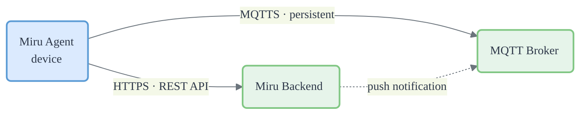
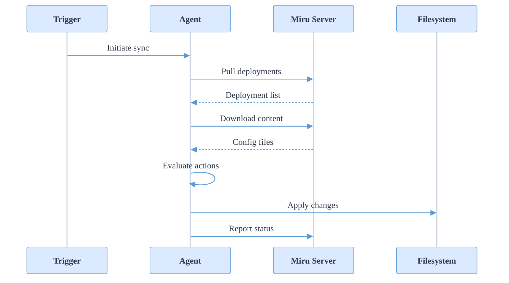

The Miru Agent is a background service that keeps your device's configurations in sync with the Miru server. This page explains how the agent communicates with the server, how deployments reach your device, and what to expect during normal operation, failures, and restarts.

## Server communication

The agent communicates with the Miru server through outbound-only channels. All traffic is initiated by the agent—no inbound ports need to be opened on the device.

### HTTPS

HTTPS is the primary communication channel between the agent and the server.

The agent makes REST API calls to the Miru backend to pull deployments and configuration content from the server, push deployment status updates back, and manage authentication tokens.

Essentially, all of the heavy lifting for the agent is done over HTTPS.

### MQTTS

MQTTS is used as a notification channel between the agent, enabling both real-time and offline communication between the two.

The agent maintains a persistent connection to an MQTT broker over TLS. The server uses this channel to push real-time notifications to the agent, letting the agent know that it needs to sync its local state with the server's state.

The MQTT broker is also used as a notification queue--when the agent is offline notifications sent to the agent are stored in the broker and delivered to the agent the instant it comes back online.

## Sync cycle

A **sync** is the process of reconciling the device's local state with the server's state.

Fundamentally, a sync performs three operations:

1. Fetches the server's state
2. Applies any changes to the local state to reconcile it with the server state
3. Reports the device's updated state to the server

### Triggers

Syncs are triggered in three ways:

1. **Server push** — the server sends an MQTT notification when a new deployment is ready
2. **Periodic polling** — the agent polls the server on a regular interval as a fallback
3. **Manual request** — a local application can request a sync through the agent's [REST API](/docs/developers/agent-api/overview)

When a sync runs, the agent:

1. Pulls the list of active deployments from the server
2. Downloads the configuration content for those deployments
3. Evaluates what action to take for each deployment (deploy, remove, or wait)
4. Applies changes to the local filesystem
5. Reports the updated deployment status back to the server

## Deployments

Each deployment has a [target state](/docs/learn/deployments#target-status) set by the server (what should happen) and an [activity state](/docs/learn/deployments#activity-status) tracked by the agent (what has happened). During each sync, the agent compares these two states and determines the appropriate action.

For example, when the server sets a deployment's target to `deployed`, the agent copies the configuration files to the device's filesystem and updates the activity state to reflect the successful deployment. When the server sets a target to `archived`, the agent removes the files.

### Atomicity

Miru deployments are **atomic**. That is, when a new deployment replaces an existing one, either all of the new deployment's config instances are written to the filesystem or none of them are. 

It is not possible for some of the new deployment's config instances to be written to the file system and others to be skipped.

Only one deployment can be actively deployed to the filesystem at a time. When a new deployment replaces an existing one, the agent atomically replaces the previous deployment's files with the new ones.

### Failure and retry

If a deployment fails (for example, due to a disk error), the agent does not immediately retry. Instead, it enters a cooldown period that grows with each consecutive failure. This prevents the agent from repeatedly attempting a broken deployment and consuming resources.

Once the cooldown expires, the agent retries the deployment on the next sync. If the deployment eventually succeeds, the retry state resets and the agent resumes normal operation.

## Offline resilience

The agent persists all state locally on the device, including deployment metadata and configuration file content. If the device loses network connectivity:

- Configurations that are already deployed remain on the filesystem and continue to be served by the local [REST API](/docs/developers/agent-api/overview)
- The agent queues any pending work and retries when connectivity returns
- No data is lost — the agent picks up where it left off after reconnecting

## Shutdown and restart

When the agent is stopped (via `systemctl stop miru` or system shutdown), it shuts down gracefully:

1. Finishes any in-flight sync operations
2. Disconnects from the MQTT broker
3. Updates the device's status to offline
4. Closes the local REST API socket

On restart, the agent reconnects to the server, refreshes its authentication token, and triggers a sync to reconcile any changes that occurred while it was offline.
