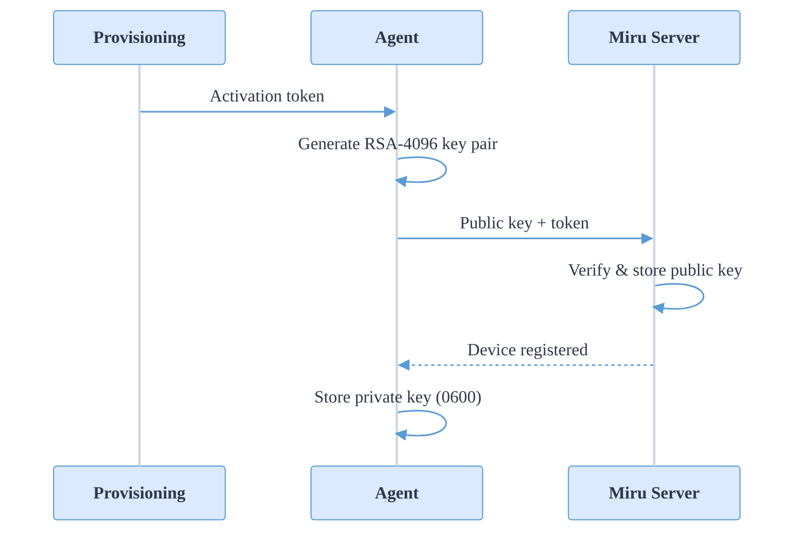
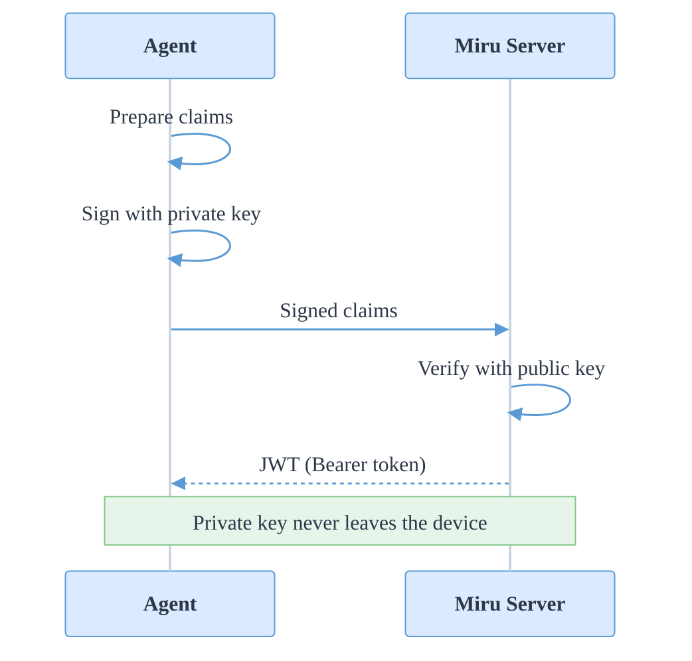

The Miru Agent is designed to run with minimal privileges and a restricted system footprint. This page describes the agent's authentication model and the security measures applied at the process, filesystem, network, and credential layers.

The agent is fully open source. All security measures described here can be inspected directly in the [agent repository](https://github.com/mirurobotics/agent).

## Device authentication

When the agent is first installed on a device, it goes through an activation process that establishes the device's identity:

1. The agent receives a short-lived **activation token** as part of the [provisioning](/docs/learn/devices/provision) process (either from the dashboard or an API key)
2. The agent generates a **4096-bit RSA key pair** on the device
3. The agent sends the **public key** to the Miru server along with the activation token
4. The server verifies the activation token, stores the public key, and registers the device
5. The agent stores the **private key** securely on the device with restricted file permissions

After activation, the device's identity is tied to its RSA key pair. The private key never leaves the device and is used to prove the device's identity in all subsequent communication with the server.

## Token lifecycle

After activation, the agent authenticates API requests using short-lived JSON Web Tokens (JWTs). The process for obtaining a token works as follows:

1. The agent prepares a set of claims including its device ID, a unique nonce, and a short expiration window
2. The agent **signs** these claims with its private RSA key
3. The agent sends the signed claims to the server's token endpoint
4. The server **verifies** the signature against the device's stored public key
5. If valid, the server issues a JWT that the agent uses as a Bearer token for all subsequent API requests

This approach means the server can verify the device's identity without the private key ever being transmitted over the network.

## Automatic token refresh

The agent runs a background process that monitors token expiration and automatically refreshes tokens before they expire. Under normal operation, this is invisible — the agent always has a valid token available for API requests.

If a token refresh fails due to a transient network issue, the agent retries automatically with increasing delays between attempts. Network interruptions do not permanently break authentication — the agent resumes normal token refresh as soon as connectivity is restored.

## Credential storage

The agent's identity is bound to an RSA key pair generated on the device during [provisioning](/docs/learn/devices/provision). These credentials are protected at rest through filesystem permissions:

| File | Permissions | Access |
|------|------------|--------|
| Private key | `0600` | Owner (miru) read/write only |
| Public key | `0640` | Owner read/write, group read-only |

All credential files are stored under `/var/lib/miru/auth/`, owned by `miru:miru`. The private key never leaves the device — it is used locally to sign token requests but is never transmitted over the network.

Sensitive values are handled in memory using a secrecy library that minimizes exposure and zeroizes data when it is no longer needed. Tokens are redacted in log output to prevent accidental credential leakage through logs.

Key and token files are written atomically to prevent partial writes from leaving corrupted credentials on disk in the event of a crash or power loss.

## Process sandboxing

The agent runs as a systemd service with extensive hardening directives that restrict what the process can access, even if the application code is compromised. The service unit file is at [`build/debian/miru.service`](https://github.com/mirurobotics/agent/blob/main/build/debian/miru.service) in the agent repository.

```mermaid
%%{init: {
  'theme': 'base',
  'themeVariables': {
    'primaryColor': '#e8f4f8',
    'primaryTextColor': '#2d3748',
    'primaryBorderColor': '#5b9bd5',
    'lineColor': '#6c757d',
    'fontFamily': 'system-ui, sans-serif',
    'fontSize': '13px'
  },
  'flowchart': {
    'nodeSpacing': 30,
    'rankSpacing': 40,
    'curve': 'basis',
    'htmlLabels': true,
    'defaultRenderer': 'elk'
  }
}}%%
graph TB
    classDef allowed fill:#e6f4ea,stroke:#81c784,stroke-width:2px,color:#2d3748
    classDef blocked fill:#fce4ec,stroke:#e57373,stroke-width:2px,color:#2d3748
    classDef readonly fill:#fff9c4,stroke:#e6c619,stroke-width:2px,color:#2d3748
    classDef sandbox fill:#dbeafe,stroke:#5b9bd5,stroke-width:2px,color:#2d3748

    subgraph device["Device OS"]
        subgraph systemd["systemd hardening"]
            subgraph agent["miru agent · unprivileged user · NoNewPrivileges"]
                rw_state("/var/lib/miru · state + credentials"):::allowed
                rw_logs("/var/log/miru · logs"):::allowed
                rw_srv("/srv/miru · deployed configs"):::allowed
                socket("/run/miru/miru.sock · local API"):::allowed
            end
        end
        blocked_home("ProtectHome · /home"):::blocked
        blocked_kernel("kernel modules · /proc/sys"):::blocked
        blocked_devices("physical devices"):::blocked
        blocked_net("netlink · packet sockets"):::blocked
        ro("read-only root filesystem"):::readonly
    end

    style device fill:#f7fafc,stroke:#cbd5e0,stroke-width:1px,color:#2d3748
    style systemd fill:#f0f4f8,stroke:#94a3b8,stroke-width:1px,color:#4a5568
    style agent fill:#dbeafe,stroke:#5b9bd5,stroke-width:2px,color:#2d3748
```

**Dedicated service account** — the agent runs as an unprivileged `miru` system user and group. The user has no login shell (`/bin/false`) and cannot be used for interactive access.

**No privilege escalation** — `NoNewPrivileges` is enabled, preventing the process from gaining additional privileges through setuid binaries or other mechanisms.

**Filesystem restrictions** — the root filesystem is mounted read-only (`ProtectSystem=strict`). The agent can only write to three specific directories:

| Path | Purpose |
|------|---------|
| `/var/lib/miru` | Agent state and authentication credentials |
| `/var/log/miru` | Log files |
| `/srv/miru` | Deployed configuration files |

Home directories are inaccessible (`ProtectHome=true`), and the agent receives a private `/tmp` (`PrivateTmp=true`).

**Kernel isolation** — the agent cannot load kernel modules, modify kernel tunables (`/proc/sys`, `/sys`), or alter control groups. Other processes are hidden from the agent's view of `/proc`.

**Device restrictions** — access to `/dev` is limited to essential pseudo-devices. Physical hardware devices are inaccessible.

**Network restrictions** — the agent can only create Unix domain sockets and IPv4/IPv6 connections. All other socket types (Netlink, packet sockets, etc.) are blocked.

## Transport security

All communication between the agent and the Miru server is encrypted in transit:

- **HTTPS** — REST API calls use HTTPS with TLS certificate validation
- **MQTTS** — the persistent MQTT connection uses TLS on port 8883 (the standard MQTT over TLS port)

The agent does not support plaintext HTTP or unencrypted MQTT in production. Both channels default to TLS-secured transports.

## Network posture

The agent initiates all connections outbound. No inbound ports need to be opened on the device and no listening network sockets are created.

The only local interface is a Unix domain socket at `/run/miru/miru.sock`, used by applications on the same device to query the agent's [REST API](/docs/developers/agent-api/overview). This socket is not accessible over the network.

## Local API access control

The agent's local REST API is exposed through a Unix domain socket, not a TCP port. Access is controlled through filesystem permissions:

- **Socket permissions** — the socket is created with mode `0660`, restricting access to the `miru` user and group
- **Socket activation** — systemd manages the socket lifecycle, creating it before the agent starts and removing it when the agent stops
- **Group-based access** — applications that need to query the agent are added to the `miru` group

This means only processes running as the `miru` user or in the `miru` group can communicate with the agent's local API. Other users and processes on the device cannot access it.

## Binary integrity

The installation script verifies the agent binary before installing it:

1. The `.deb` package and a SHA-256 checksums file are downloaded from GitHub Releases over HTTPS
2. The package's SHA-256 hash is computed locally and compared against the published checksum
3. Installation aborts if the checksum does not match
4. The package format, name, and architecture are validated before installation proceeds

## Security summary

| Layer | Measure |
|-------|---------|
| Authentication | RSA-4096 key pair, short-lived JWTs, unique nonce per request |
| Process | Unprivileged user, NoNewPrivileges, systemd sandboxing (13+ directives) |
| Filesystem | Read-only root, three writable paths, private /tmp, no home access |
| Credentials | RSA-4096, private key 0600, atomic writes, in-memory zeroization |
| Network | Outbound-only, TLS on all channels, no listening TCP ports |
| Local API | Unix socket, mode 0660, group-based access control |
| Installation | SHA-256 checksum verification, HTTPS downloads |
