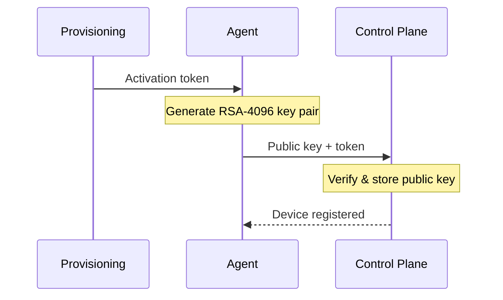
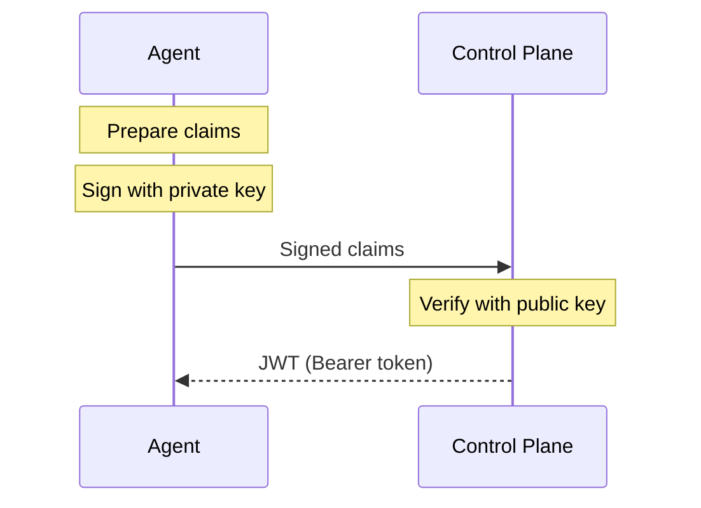

The Miru Agent is designed to run with minimal privileges and a restricted system footprint. This page describes the agent's authentication model, authorizations, and the security measures applied at the process, filesystem, network, and credential layers.

## Authentication

When the agent is first installed on a device, it goes through an activation process that establishes the device's identity:

1. The agent receives a short-lived activation token as part of the [provisioning](/docs/learn/devices/provision) process (either from the dashboard or an API key)
2. The agent generates a 4096-bit RSA key pair on the device
3. The agent sends the public key to the Miru control plane with its activation token
4. The control plane verifies the activation token, stores the public key, and registers the device

After activation, the device's identity is tied to its RSA key pair. Notably, the key pair is generated on-device and the private key never leaves the device. 

In all subsequent communication with the control plane, the private key is used to generate a short-lived JWT that authenticates the agent's requests.

### Token lifecycle

After activation, the agent authenticates API requests using short-lived JSON Web Tokens (JWTs). The process for obtaining a token works as follows:

1. The agent prepares a set of claims including its device ID, a unique nonce, and a short expiration window (a few minutes)
2. The agent signs these claims with its private RSA key
3. The agent sends the signed claims to the control plane's token endpoint
4. The control plane verifies the signature against the device's registered public key
5. If valid, the control plane issues a short-lived JWT that the agent can use for subsequent API requests

### Token refresh

Since the JWT is short-lived, the agent runs a background process that monitors token expiration and automatically refreshes tokens before they expire. Under normal operation, this is invisible—the agent always has a valid token available for API requests.

If a token refresh fails due to a transient network issue, the agent retries automatically with increasing delays between attempts. Network interruptions do not permanently break authentication—the agent resumes normal token refresh as soon as connectivity is restored.

### Credential storage

The agent's identity is bound to the RSA key pair generated on-device during [provisioning](/docs/learn/devices/provision). Currently, these credentials are protected at rest through filesystem permissions:

| File | Permissions | Access |
|------|------------|--------|
| Private key | `0600` | Owner (miru) read/write only |
| Public key | `0640` | Owner read/write, group read-only |

All credential files are stored under `/var/lib/miru/auth/`, owned by `miru:miru`. The private key never leaves the device—it is used locally to sign token requests but is never transmitted over the network.

Sensitive values are handled in memory using a secrecy library that minimizes exposure and zeroizes data when it is no longer needed. Tokens are redacted in log output to prevent accidental credential leakage through logs.

## Authorizations

After authentication, the control plane authorizes every request in the context of the calling device identity.

Authorization is strictly device-scoped:

- A device can only read deployments assigned to that device
- A device can only download configuration instances referenced by those assigned deployments
- A device can only report status for its own deployment records

A device cannot access fleet data outside its scope:

- It cannot list or read deployments for other devices
- It cannot download configuration instances that are not part of its assigned deployments
- It cannot write status updates for another device

This prevents lateral access between devices. Even if two devices run the same agent version, each device is isolated to its own control-plane view and assigned configuration state.

## Process sandboxing

The agent runs as a [systemd](https://en.wikipedia.org/wiki/Systemd) service with extensive hardening directives that restrict what the process can access, even if the application code is compromised. 

**Dedicated service account**

The agent runs as an unprivileged `miru` system user and group. The user has no login shell (`/bin/false`) and cannot be used for interactive access.

You can find the agent's service unit file in the [/build/debian/miru.service](https://github.com/mirurobotics/agent/blob/main/build/debian/miru.service) file in the agent repository.

**No privilege escalation**

`NoNewPrivileges` is enabled, preventing the process from gaining additional privileges through setuid binaries or other mechanisms.

**Filesystem restrictions**

The root filesystem is mounted read-only (`ProtectSystem=strict`). The agent can only write to three specific directories:

| Path | Purpose |
|------|---------|
| `/var/lib/miru` | Agent state / credentials (internal only) |
| `/var/log/miru` | Log files (internal only) |
| `/srv/miru` | Deployed configuration files |

Home directories are inaccessible (`ProtectHome=true`), and the agent receives a private `/tmp` (`PrivateTmp=true`).

**Kernel isolation**

The agent cannot load kernel modules, modify kernel tunables (`/proc/sys`, `/sys`), or alter control groups. Other processes are hidden from the agent's view of `/proc`.

**Device restrictions**

Access to `/dev` is limited to essential pseudo-devices. Physical hardware devices are inaccessible.

**Network restrictions**

The agent can only create Unix domain sockets and IPv4/IPv6 connections. All other socket types (Netlink, packet sockets, etc.) are blocked.

## Transport security

All communication between the agent and the Miru control plane is encrypted in transit:

- **HTTPS** — REST API calls use HTTPS with TLS certificate validation
- **MQTTS** — the persistent MQTT connection uses TLS on port 8883 (the standard MQTT over TLS port)

## Network posture

The agent initiates all connections outbound. No inbound ports need to be opened on the device and no listening network sockets are created.

The only local interface is a Unix domain socket at `/run/miru/miru.sock`, used by applications on the same device to query the agent's [REST API](/docs/developers/agent-api/overview). This socket is not accessible over the network.

## Local API access control

The agent's local REST API is exposed through a Unix domain socket, not a TCP port. It is not possible to access the agent's local API over a network--it is only accessible from processes running on the same device as the agent.

Access is controlled through filesystem permissions:

- **Socket permissions** — the socket is created with mode `0660`, restricting access to the `miru` user and group
- **Socket activation** — `systemd` manages the socket lifecycle, creating it before the agent starts and removing it when the agent stops
- **Group-based access** — applications that need to query the agent are added to the `miru` group

This means only processes running as the `miru` user or in the `miru` group can communicate with the agent's local API. Other users and processes on the device cannot access it.

{/* ## Installation

TODO: Add details about installation security once APT repository is available */}
