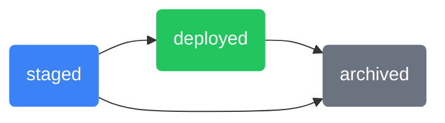
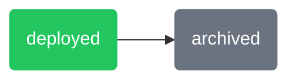
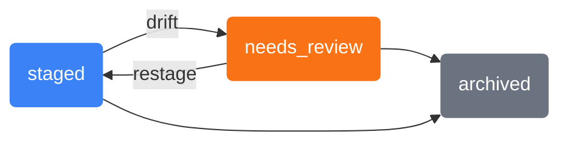
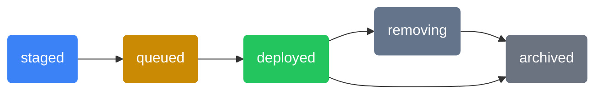
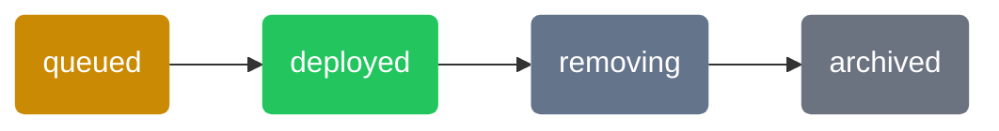
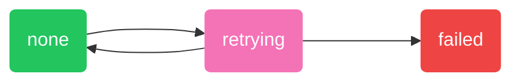

import DeploymentDef from '/snippets/definitions/deployment.mdx';
import DeploymentConstraints from '/snippets/definitions/deployment-constraints.mdx';
import DeploymentStatus from '/snippets/deployments/status.mdx';
import {EditableBadge, MutableBadge, ImmutableBadge, NullableBadge} from '/snippets/components/badges.jsx';
import {ONLINE_TOOLTIP, OFFLINE_TOOLTIP} from '/snippets/components/devices/statuses.jsx';
import {Framed} from '/snippets/components/framed.jsx';

<Framed background="https://assets.mirurobotics.com/docs/v03/images/deployments/background.jpeg" image="https://assets.mirurobotics.com/docs/v03/images/deployments/header:panel.png" borderWidth="28px 56px 0 0" innerRadius="0 8px 0 0" />

<DeploymentDef />

<DeploymentConstraints />

## Properties

<ParamField path="description" type="string">
  <ImmutableBadge />

  A user-provided description of the deployment.

  Example: "increase acceleration limit to 1.2 m/s^2"
</ParamField>

<ParamField path="target status" type="enum">
  <EditableBadge />

  The [desired state](#target-status) of the deployment.

  Allowed values: 
  - `staged`
  - `deployed`
  - `archived`

</ParamField>

<ParamField path="activity status" type="enum">
  <MutableBadge />

  The deployment's last known [activity state](#activity-status).

  Allowed values: 
  - `staged`
  - `needs_review`
  - `queued`
  - `deployed`
  - `removing`
  - `archived`

</ParamField>

<ParamField path="error status" type="enum">
  <MutableBadge />

  The deployment's last known [error state](#error-status).

  Allowed values: 
  - `none`
  - `failed`
  - `retrying`
</ParamField>

<ParamField path="status" type="string">
  <MutableBadge />

  <DeploymentStatus />

  Enum: `staged`, `needs_review`, `queued`, `deployed`, `removing`, `archived`, `failed`, `retrying`
</ParamField>

<ParamField path="parent" type="Deployment">
  <ImmutableBadge />

  {' '}

  <NullableBadge />

  The deployment from which this deployment was patched.

  Examples: `DPL-L5B8b`
</ParamField>

<ParamField path="release" type="Release">
  <ImmutableBadge />

  The [release](/docs/learn/releases/overview#properties) which the deployment adheres to.

  Examples: `1.0.1`, `1.7.0-beta.1`
</ParamField>

<ParamField path="config instances" type="[] Config Instance">
  <ImmutableBadge />

  The [config instances](/docs/learn/config-instances#properties) in the deployment, each of which satisfies a different config schema in the deployment's release.

  Examples: `CFG-68hdX`, `CFG-Cpa13`
</ParamField>

## Methods

Broadly speaking, there are two methods for creating and deploying configurations. Configurations can be:

1. Edited per device via the [config editor](/docs/learn/devices/config-editor)
2. Staged in a release's [staging area](/docs/learn/releases/staging-area) to be deployed at a later time

**Per-Device Editing**

Each device has a dedicated config editor for viewing and editing its configurations. Changes made in the config editor are immediately deployed to the device.

The config editor deals only with a single device's configurations. It does not support multiple devices at once nor does it support staging new deployments.

For more information, check out the [config editor](/docs/learn/devices/config-editor) documentation.

**Release Staging**

Staging a deployment is the process of creating a new deployment in a release's [staging area](/docs/learn/releases/staging-area) to be deployed in the future. Staging is primarily used to rollout a new release, providing an unobstrusive place to create and review deployments before being deployed to devices. 

A release's staging area is also useful for batch operations. Deployments can be created, deployed, and archived in bulk, which helps manage large numbers of deployments at once.

For more information, check out the [staging area](/docs/learn/releases/staging-area) documentation.

## Status

<DeploymentStatus />

## Target Status

The target status is the desired state of a deployment. There are three possible target statuses.

| Target Status | Description                                                               |
| ------------- | ------------------------------------------------------------------------- |
| `staged`      | Deployment doesn't want to be deployed, but may be deployed in the future |
| `deployed`    | Deployment wants to be delivered to its device                            |
| `archived`    | Deployment no longer wants to be deployed; it can never be deployed again |

**With Staging**

If a deployment is staged before being deployed, the diagram below shows the valid transitions between target statuses.

**Without Staging**

Of course, many deployments skip staging and deploy immediately (such as those deployed from a device's [config editor](/docs/learn/devices/config-editor)). The diagram below shows the valid transitions between target statuses for a deployment that is immediately deployed.

**One-Time Use**

As you can see, the target status can only move _forward_, never backwards.

Once a deployment's target status has been set to `deployed`, it can never be set to `staged` again.  Similarly, once a deployment's target status has been set to `archived`, it can never be set to `deployed` again.

This is intentional--deployments are one-time use. Once a deployment has been deployed, it cannot be redeployed. You must create a new deployment with identical content to roll back.

## Activity Status

The activity status is the _last known_ state of a deployment.

We use _the last known state_ intentionally -- poor network connectivity can prevent devices from immediately syncing their activity state with the cloud. In practice, this isn't too common. However, it's still a critical point to keep in mind.

There are six possible activity states for a deployment.

| Activity Status | Description                                                                                                                     |
| --------------- | ------------------------------------------------------------------------------------------------------------------------------- |
| `staged`        | Deployment has been created and is ready to be deployed                                                                         |
| `needs review`  | Deployment has [drifted](/docs/learn/releases/staging-area#deployment-drift) and needs to be reviewed                           |
| `queued`        | Deployment is waiting for the device to be <Tooltip tip={ONLINE_TOOLTIP.tip} cta={ONLINE_TOOLTIP.cta} href={ONLINE_TOOLTIP.href}>online</Tooltip> so it can be delivered to the device |
| `deployed`      | Deployment has been delivered to the device, and its configurations are available for consumption                               |
| `removing`      | Deployment will be removed from the device as soon as the device is `online`                                                    |
| `archived`      | Deployment is available for historical reference, but can never be deployed again                                               |

**With Staging**

When a deployment is [staged](/docs/learn/releases/staging-area) before being deployed, its lifecycle has two phases: a **review phase** and a **deployment phase**.

During the review phase, a staged deployment may [drift](/docs/learn/releases/staging-area#deployment-drift) if the underlying release changes. A drifted deployment transitions to `needs_review` and must either be restaged or archived.

Once the deployment is approved, it enters the deployment phase. The deployment is queued for delivery to the device, delivered, and eventually archived.

**Without Staging**

Deployments which are immediately deployed and skip the `staged` state have a simpler lifecycle. They simply go through the primary deployment lifecycle from `queued` to `archived`.

**One-Time Use**

As with the target status, activity states can only progress forward since deployments are one-time.

## Error Status

The error status is the _last known_ error state of a deployment. Again, we use _the last known state_ intentionally -- poor network connectivity can prevent devices from immediately syncing their error state to the cloud.

The error status is independent of the activity and target statuses. The error status does not imply any particular activity or target state, and vice versa. The error status is only concerned with errors encountered during deployment.

There are three possible error states for a deployment.

| Error Status | Description                                                                                             |
| ------------ | ------------------------------------------------------------------------------------------------------- |
| `none`       | There are no errors with the deployment                                                                 |
| `retrying`   | A non-fatal error has been encountered; the agent is retrying to fulfill the deployment's target status |
| `failed`     | A fatal error has been encountered; the deployment is (or will be) removed from the device and archived |

Below are the valid transitions between error states.

Deployments start in the `none` error state. If no errors are encountered, the deployment remains in the `none` error state for the duration of its existence.

**Non-Fatal Errors**

If a non-fatal error is encountered, the deployment transitions to the `retrying` error state. Non-fatal errors include unexpected network drops, sudden power cycles, and similar events.

If the agent recovers the deployment from the error, the deployment transitions back to the `none` error state once the deployment's target status is reached.

On the other hand, as long as the agent is unable to recover the deployment, the deployment remains in the `retrying` error state. The agent continually attempts to reach the deployment's target status, using exponential backoff to prevent resource throttling.

If the deployment is stuck in the `retrying` error state, try replacing or archiving the deployment to allow the agent to start fresh.

**Fatal Errors**

If a fatal error is encountered, the deployment transitions to the `failed` error state, is removed from the device, and marked as `archived`.